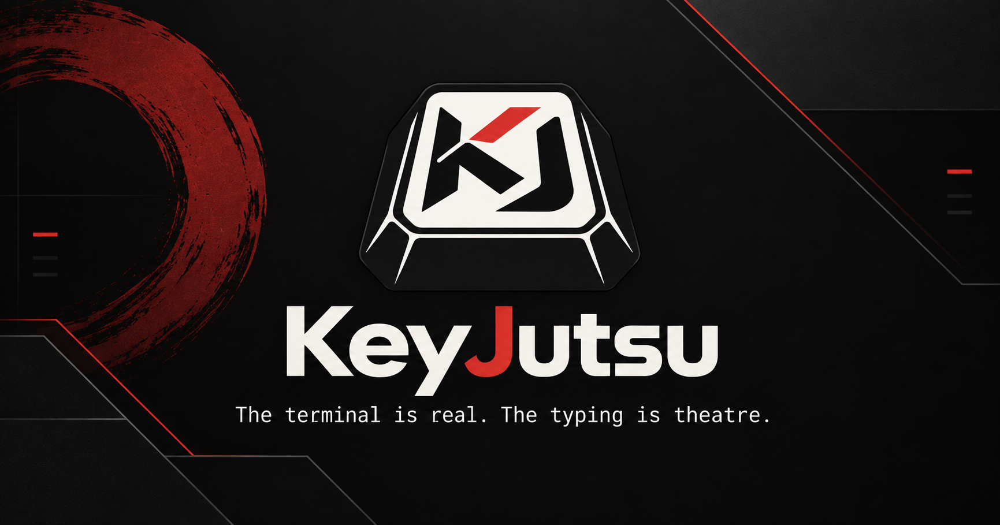

<h1 align="center">
  
</h1>

**Mash random keys while real, validated commands type themselves perfectly
and run in a real shell. The typing is theatre; everything that runs was
checked and approved by you first.**

[](https://github.com/ntatschner/keyjutsu/actions/workflows/ci.yml)
[](LICENSE)
[](docs/guides/installing.md)

Underneath the show, the idea is serious. An AI agent you already use
investigates your problem and proposes a plan. KeyJutsu checks every command
against your actual machine, without running any of them. You read it and
approve it. Only then does anything run, one keystroke of yours at a time,
with each step checked after it runs.

> **Status: early.** All 17 milestones of the specification are built, and
> the eight release gates pass. Early means there's no published release or
> signed installer yet, and the gaps the
> [threat model](THREAT_MODEL.md#not-covered) lists are real.

## Start here

- **You use a terminal and an AI coding agent already.** Read on, then
  [install it](docs/guides/installing.md) and
  [try the demo](docs/guides/first-performance.md). Five minutes.
- **You're new to AI or to terminals.** Start with
  [KeyJutsu in plain words](docs/plain/README.md). It explains what an agent
  and a plan are before it asks you to type anything.
- **You want to know whether to trust it.** The
  [threat model](THREAT_MODEL.md) says what's protected, from whom, what's
  tested, and what isn't covered.

## What it does for you

### The performance: any key, the right command

Each key you press types the next character of an approved command, whatever
the key was. When the command's complete, the next key runs it, for real, in
PowerShell 7, Windows PowerShell or `cmd`, inside Windows' own pseudo-console.
A step moves on when the shell reports it finished, never on a timer, and a
failure stops everything and gives you the keyboard back. Ctrl+Alt+Shift+K
takes the terminal back at any moment.

```powershell
keyjutsu demo --clean
```

On a clean Windows 11 in Windows Sandbox, the demo's three commands took 595
mashed keys, and not one of those keys reached the shell as itself.

[Your first performance, step by step](docs/guides/first-performance.md)

### Plans from the agent you already use, kept read-only

KeyJutsu doesn't bring its own AI. It runs Codex, Claude Code, Gemini, GitHub
Copilot or Cursor under your own account, each in its own read-only mode, and
takes back a plan: data, not a script. You see what would be sent before it's
sent, and anything that looks like a secret is taken out first.

```powershell
keyjutsu plan propose "Find out why the Print Spooler keeps stopping" --agent claude --out spooler.json
```

[Getting a plan from an agent](docs/guides/planning.md)

### Checks that run nothing, and approval that means something

Validation reads every command through PowerShell's own parser and checks it
against this machine: does it exist, are its parameters real, what does it
need, how risky is it. KeyJutsu rates risk itself; an agent can raise a
step's risk but never lower it. Approving seals the plan so that changing any
step voids its approval, and a critical step needs its own typed phrase,
which no amount of key-mashing can produce.

```powershell
keyjutsu plan validate spooler.json
keyjutsu plan approve spooler.json --out spooler.approved.json
```


### A run that checks itself, and stops rather than guesses

Before anything's typed, the machine is compared with the one the plan was
approved on. After each step, its checks run. Passwords are typed by you
into PowerShell's own masked prompt, never by KeyJutsu. Administrator steps
go through one UAC prompt before the performance, not halfway through it.
A step that failed stays failed until you decide: look first, undo with a
plan you've read, or repair and carry on.

```powershell
keyjutsu run spooler.approved.json
```

[Running a plan](docs/guides/running-a-plan.md) ·
[When a run stops](docs/guides/when-a-run-stops.md)

### Plans that survive a restart, and plans you can reuse

A plan can stop for a Windows restart and carry on afterwards, once
KeyJutsu has checked the restart really happened and what came before still
holds. A run that worked can become a Technique, to use again with new
values, and it's validated again rather than trusted because it worked once.

[Reusing a plan that worked](docs/guides/techniques.md)

## Install

Windows 11, x64. There's no published release yet; build the installer with
`pnpm desktop:build` (below), then follow
[Installing](docs/guides/installing.md). It installs for every user, asks for
Administrator once, and offers to put `keyjutsu` on your PATH and "Open
KeyJutsu here" on Explorer's folder menus.

## Build from source

You need Rust 1.88 or later, Node 22 or later and pnpm 9.

```powershell
pnpm install
cargo run -p keyjutsu-cli -- doctor     # is this machine ready?
cargo run -p keyjutsu-cli -- demo       # mash keys; read-only commands appear
pnpm desktop:dev                        # the desktop app
pnpm desktop:build                      # the installer, in target/release/bundle/nsis/
```

[Contributing](CONTRIBUTING.md) has the tests and the checks a change has to
pass.

## How it holds together

- The typed text comes from the shell's own echo, not from KeyJutsu drawing
  what it meant to type. A step finishes when the shell reports it finished,
  through prompt marks stamped with a per-session secret.
- A failed command stops the performance and hands the keyboard back. It
  doesn't carry on to keep the show going.
- The desktop's React code can only ask. Every rule about what may reach the
  shell lives in the Rust core, which the desktop app and the CLI share.

## Documentation

[The documentation index](docs/README.md) has everything: guides,
plain-language pages, the [command reference](docs/commands.md),
[recipes](docs/recipes.md), and the internals, from the
[architecture](docs/architecture/overview.md) to every
[deviation from the specification](docs/architecture/deviations.md).

## Help

Stuck? [Getting help](SUPPORT.md) says what to try first and what to include.
Found a security problem? [SECURITY.md](SECURITY.md) says how to report it
privately. Everyone taking part is asked to follow the
[code of conduct](CODE_OF_CONDUCT.md).

## Privacy

No telemetry, no crash reporting, no update check. KeyJutsu's only network
requests are the downloads a plan names, when you stage them; agents talk to
their own providers under your account. [PRIVACY.md](PRIVACY.md) has what's
stored and where.

## Licence

GNU General Public License, version 3 only (`GPL-3.0-only`). See
[LICENSE](LICENSE).

You can use, study, change and share KeyJutsu freely. If you distribute a
modified version, you must publish its source under the same licence, so a
closed fork isn't possible. The libraries KeyJutsu builds on keep their own
permissive licences (MIT, Apache-2.0, BSD, Zlib, ISC, MPL-2.0), all of which
can be combined with GPL-3.0. Why this licence and not the Apache-2.0 the
specification names: [ADR 0012](docs/architecture/adr/0012-gpl-3-licence.md).
