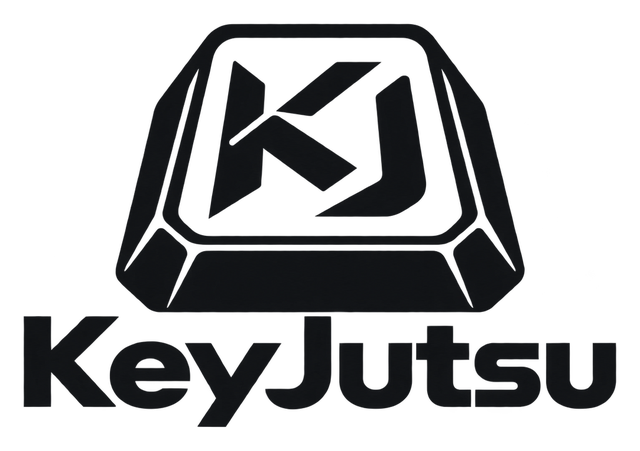

<h1 align="center">
  <picture>
    <source media="(prefers-color-scheme: dark)" srcset="assets/brand/keyjutsu-stacked-white.png">
    
  </picture>
</h1>

KeyJutsu lets you mash random keys while flawless, genuinely working terminal
commands appear and run in a real shell.

The commands are real, the terminal is real and the changes to your machine
are real. Only the typing is theatre. Underneath, the idea is serious: an AI
agent proposes a plan, KeyJutsu checks it against your actual machine, you
review and approve it, and only then does anything run, with each step checked
after it runs.

> **Status: early.** Milestones 0 to 3 of 17 are built: the real terminal, the
> performance engine and the plan model. There are no agents, approval or
> validation yet, so today KeyJutsu performs a built-in read-only demo or
> commands you type in yourself, and can check a plan file with
> `keyjutsu plan check`. What exists and what does not:
> [milestones 0 to 2](docs/architecture/milestones-0-2.md),
> [milestone 3](docs/architecture/milestone-3.md).

Windows 11 x64 only for now.

## Try it

You need Rust (1.88 or later), Node 22+, pnpm 9 and PowerShell 7 for the best
experience; Windows PowerShell 5.1 and cmd work too.

```powershell
pnpm install
cargo run -p keyjutsu-cli -- doctor        # is this machine ready?
cargo run -p keyjutsu-cli -- demo          # mash keys; read-only commands appear
cargo run -p keyjutsu-cli -- perform -c "Get-Service -Name Winmgmt"
pnpm desktop:dev                            # the desktop app
```

While a performance is armed:

| Key | Does |
| --- | --- |
| Any ordinary key | types the next character of the staged command (or a word, with `--turbo`) |
| Any key at the end of a command | submits it (configurable: `--submit enter` or `--submit auto`) |
| Ctrl+C | a real interrupt, always |
| Esc | goes to a running command; ignored while KeyJutsu is typing |
| Ctrl+Shift+K | private operator controls (desktop); pause and resume (CLI) |
| Ctrl+Alt+Shift+K | disarm immediately and hand the terminal back |

`--mode auto` types and runs everything by itself; `--mode direct` skips the
typing effect entirely.

## How it holds together

- The typed text comes from the shell's own echo, not from KeyJutsu drawing
  what it meant to type. A step finishes when the shell reports it finished,
  through prompt marks stamped with a per-session secret, never when a timer
  runs out.
- A failed command stops the performance and hands the keyboard back. It does
  not carry on to keep the show going.
- The desktop's React code can only ask. Every rule about what may reach the
  shell lives in the Rust core, which the desktop app and the CLI share.

[Architecture](docs/architecture/overview.md) ·
[State machine](docs/architecture/execution-state-machine.md) ·
[Decisions](docs/architecture/adr/README.md) ·
[Threat model](THREAT_MODEL.md) ·
[Plan schema](docs/schemas/plan.md) ·
[Deviations from the specification](docs/architecture/deviations.md)

## Privacy

No telemetry, no crash reporting, no network calls. See [PRIVACY.md](PRIVACY.md).

## Licence

GNU General Public License, version 3 only (`GPL-3.0-only`). See
[LICENSE](LICENSE).

You can use, study, change and share KeyJutsu freely. If you distribute a
modified version, you must publish its source under the same licence, so a
closed fork is not possible. The libraries KeyJutsu builds on keep their own
permissive licences (MIT, Apache-2.0, BSD, Zlib, ISC, MPL-2.0), all of which
can be combined with GPL-3.0. Why this licence and not the Apache-2.0 the
specification names: [ADR 0012](docs/architecture/adr/0012-gpl-3-licence.md).
