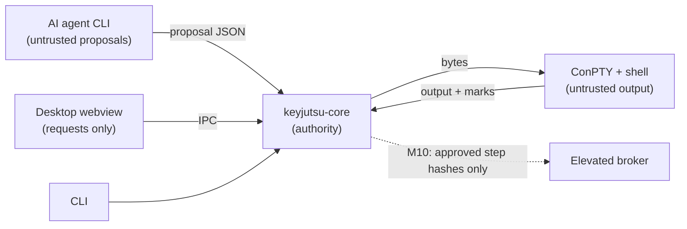

# KeyJutsu threat model

KeyJutsu types real commands into a real shell on the user's own machine, on
behalf of plans an AI agent helped write. That is a lot of trust to hold, and
this document says where it is held, what could break it, and what is done
about each threat, including the ones that are not dealt with yet.

It is kept current with the code. Each invariant below carries its actual
status. At Milestone 2 most of them are **planned**: the table says so rather
than implying protection that does not exist yet.

## What is being protected

| Asset | Why it matters |
| --- | --- |
| The user's machine state | Commands change it for real, sometimes irreversibly. |
| The operator's authority | Nothing should run that the operator did not approve (from Milestone 4). |
| Credentials and secrets | Typed by the operator, needed by commands, never meant to be stored or shown. |
| Terminal output and task content | Can contain anything, including secrets printed by commands. |
| Shell history | The user's own history file, readable by PSReadLine's predictions. |

## Who could act against it

- **An AI agent** producing a wrong, careless or manipulated plan. Agents read
  untrusted content (repositories, logs, web pages), so prompt injection is
  the expected case, not an exotic one.
- **Content in the terminal**: output from any command, which KeyJutsu parses
  for its prompt marks and renders in a webview.
- **A compromised renderer**: script running in the desktop webview.
- **Another local process** running as the same user, which can read memory
  and command lines but should not be able to escalate through KeyJutsu.
- **An imported Technique** from someone else (Milestone 14).
- **The operator by accident**: a key pressed at the wrong moment.

## Trust boundaries

## Invariants

Status: **held** means enforced in code and tested; **partial** means some of
it is; **planned** names the milestone.

| # | Invariant | Status | Where, and the test |
| --- | --- | --- | --- |
| 1 | Agent output is never execution authority. | Planned, M6 | No agent integration exists yet, so nothing an agent says can run. The proposal schema already rejects any proposal claiming readiness, proof, hashes or approval (`schemas/plan/v1`, fixture `agent-claims-readiness`). |
| 2 | Secrets never enter agent context. | Planned, M6 and M9 | |
| 3 | Approved execution snapshots are immutable. | Planned, M4 | Hashing approach proposed in [ADR 0010](docs/architecture/adr/0010-plan-hashing.md). Today's staged scripts are validated once and never modified by the engine. |
| 4 | Plan mutation invalidates affected approval. | Planned, M4 | |
| 5 | The elevated broker accepts only authorised structured operations. | Planned, M10 | Nothing runs elevated today; there is no elevated code path at all. |
| 6 | Critical actions need dedicated semantic confirmation. | Planned, M8 | |
| 7 | Credential entry cannot be staged typing. | Partial | The plan schema forbids commands on a credential step and forces user-input mode (fixture `staged-credential`). The engine has a user-input mode that forwards real keys. Secure credential handling is M9. |
| 8 | Telemetry cannot contain task or terminal contents. | Held, trivially | KeyJutsu has no telemetry, crash reporting or network code of any kind. |
| 9 | Only staged text reaches the shell while a performance owns the keyboard. | Held | `PerformanceEngine`; `mashing_arbitrary_keys_delivers_exactly_the_staged_command`, `keys_mashed_while_a_command_runs_do_not_reach_it`; end to end in `mashed_keys_type_and_run_exactly_the_staged_command` and the CLI test. |
| 10 | An incomplete staged command is never submitted. | Held | `submit()` is the only source of a staged Enter; `no_sequence_of_keys_can_submit_an_incomplete_command`; a deliberate mutation letting Enter submit early broke two tests. Staged commands containing any control character are refused (`rejects_scripts_that_could_submit_part_of_a_command`). |
| 11 | The hard-disarm chord always disarms and leaves nothing half-typed. | Held | Classified first and handled before ownership is checked; `the_hard_disarm_chord_works_in_every_state_and_erases_partial_input`, `disarming_while_paused_mid_command_erases_the_partial_input`, the real-shell and CLI tests. |
| 12 | The window cannot type into a line a performance owns. | Held | `Session::write_input` refuses everything but renderer replies; `raw_input_is_refused_while_a_performance_owns_the_keyboard`, `recognises_renderer_replies_and_nothing_else`. |
| 13 | A performance cannot be armed on top of existing input or a busy shell. | Held | `Session::arm`; `arming_is_refused_on_a_dirty_or_busy_line`. |
| 14 | Steps advance on the shell's report, never on a timer, and failure stops. | Held | [ADR 0003](docs/architecture/adr/0003-completion-from-prompt-marks.md); `steps_advance_only_when_the_shell_reports_completion`, `a_failed_step_stops_the_performance_and_returns_control`. |
| 15 | Ctrl+C is always a real interrupt. | Held | [ADR 0008](docs/architecture/adr/0008-restore-ctrl-c-for-shells.md); `ctrl_c_interrupts_a_running_command`. |

## Threats and responses

| Threat | Response | Status |
| --- | --- | --- |
| A command prints a fake completion mark to make KeyJutsu move on early. | Marks carry a per-session 128-bit nonce; unmarked or wrongly marked sequences are shown as output and ignored. | Held (`a_mark_with_the_wrong_nonce_is_passed_through_untrusted`). **Limit:** a process in the session can read the shell's command line, which contains the nonce. Only an approved command could do that, and approval is where it should be caught. |
| A long or malformed escape sequence makes the scanner buffer without bound. | Anything longer than 512 bytes that is not a complete mark is released as output. | Held (`an_unterminated_sequence_is_released_once_it_is_too_long_to_be_ours`). |
| Terminal output attacks the renderer. | xterm.js parses output; the webview's CSP allows scripts only from the app itself. | Partial: relies on xterm.js. No fuzzing yet (M17). |
| A compromised renderer types into the terminal. | It can while the terminal is unarmed, as the user could. It cannot write into an armed line, arm on a dirty line, or (from M4) arm an unapproved snapshot. No plugin grants file-system or process access. | Accepted with the limits stated. |
| The disarm key fires by accident and ends a performance. | Esc is not the disarm; bindings without Ctrl, Alt or Win are refused. | Held (`bindings_that_ordinary_typing_could_trigger_are_rejected`). |
| An agent proposes an `eval`-style condition to run code during evaluation. | Conditions are a closed vocabulary with no expression form. | Held at the schema (fixture `free-form-condition`); evaluation itself is M3. |
| A reader misinterprets a future plan format. | Unknown major versions are refused. | Held at the schema (fixture `future-major-version`). |
| PSReadLine predictions show sensitive history on screen during a performance. | The clean profile turns predictions off and saves no history. The detected profile keeps the user's settings. | **Partial.** With the detected profile, predictions can show anything in the user's history. [ADR 0009](docs/architecture/adr/0009-clean-profile-hides-history.md). |
| Commands typed in a performance end up in the user's shell history. | Not saved with the clean profile. Saved with the detected profile, as the user's own commands would be. | Accepted for the detected profile; stated here so it is a choice, not a surprise. |
| The shell ignores Ctrl+C because of how KeyJutsu was launched. | The inherited ignore flag is cleared before shells start. | Held. |
| Keys typed during a running command are fed into it. | Swallowed while executing, apart from Ctrl+C and Esc. | Held. |

## Not covered yet

Everything that depends on plans, approval, agents, validation, credentials,
elevation, storage, recovery, networking and Techniques. Those arrive with
their milestones, and each milestone updates this document before it is
considered done. The release gates in the specification (§57) cannot pass
until they do.
