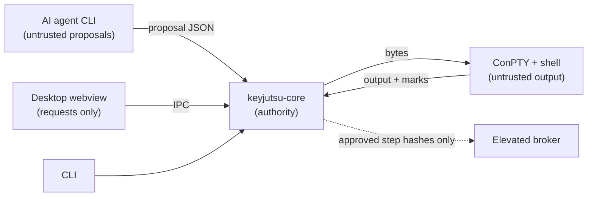

# KeyJutsu threat model

KeyJutsu types real commands into a real shell on the user's own machine, on
behalf of plans an AI agent helped write. That is a lot of trust to hold, and
this document says where it is held, what could break it, and what is done
about each threat, including the ones that are not dealt with yet.

It is kept current with the code. Each invariant below carries its actual
status, and where protection is partial the table says so rather than
implying protection that does not exist. The release gates below are named
test lists, run by `pnpm release:gates` and in CI.

## What is being protected

| Asset | Why it matters |
| --- | --- |
| The user's machine state | Commands change it for real, sometimes irreversibly. |
| The operator's authority | Nothing should run that the operator did not approve. |
| Credentials and secrets | Typed by the operator, needed by commands, never meant to be stored or shown. |
| Terminal output and task content | Can contain anything, including secrets printed by commands. |
| Shell history | The user's own history file, readable by PSReadLine's predictions. |

## Who could act against it

- **An AI agent** producing a wrong, careless or manipulated plan. Agents read
  untrusted content (repositories, logs, web pages), so prompt injection is
  the expected case, not an exotic one.
- **Content in the terminal**: output from any command, which KeyJutsu parses
  for its prompt marks and renders in a webview.
- **A compromised renderer**: script running in the desktop webview.
- **Another local process** running as the same user, which can read memory
  and command lines but should not be able to escalate through KeyJutsu.
- **An imported Technique** from someone else.
- **The operator by accident**: a key pressed at the wrong moment.

## Trust boundaries

## Invariants

Status: **held** means enforced in code and tested; **partial** means some of
it is, and the row says which part is not.

| # | Invariant | Status | Where, and the test |
| --- | --- | --- | --- |
| 1 | Agent output is never execution authority. | Held for everything built so far | Agents run in their read-only modes (`every_invocation_asks_for_read_only_investigation`, `no_invocation_ever_bypasses_the_agents_own_safeguards`); what they return is a proposal that must pass `parse_proposal`, which refuses any claim of readiness, proof, hashes or approval; KeyJutsu decides control flow and validates independently; the agent's identity is KeyJutsu's to state. Execution follows the plan's walk from real outcomes, never from what an agent says happened (`branches_follow_real_outcomes`). |
| 2 | Secrets never enter agent context. | Partial | Everything KeyJutsu sends is redacted by pattern first: pasted text and files, the task, the operator's guidance for a revision, what validation found, what a failed step printed, and the plan itself, since an edited step may hold a value the operator typed (`a_secret_in_pasted_context_never_reaches_the_agent`, `no_secret_reaches_an_agent_by_any_route`). Credentials are typed into the shell's own masked prompt and never kept, logged or sent by KeyJutsu (invariant 7). Unrecognisable secrets are not caught, and a folder the agent investigates is read by the agent, not KeyJutsu; the manifest warns about secret-looking files there. |
| 3 | Approved execution snapshots are immutable. | Held, up to Windows' own boundary | `ApprovedSnapshot` has no mutating methods and re-checks every hash on load (`any_edit_to_a_stored_snapshot_is_refused`, ten kinds of edit; `no_edit_to_a_snapshot_is_accepted_as_something_else`, 3,000 random edits per run). The hashes alone are unkeyed, so sealing also records the snapshot hash in the DPAPI-keyed encrypted store, and `run` and `recover` refuse a snapshot this Windows account never approved on this machine (`a_snapshot_runs_only_if_this_account_approved_it`, `run_refuses_a_snapshot_this_account_did_not_approve`). A program running as the same user can ask DPAPI too, as it can run commands directly; that is Windows' boundary. The desktop runs the snapshot it holds in memory. |
| 4 | Plan mutation invalidates affected approval. | Held | Approvals bind to step hashes that chain through predecessors ([ADR 0010](docs/architecture/adr/0010-plan-hashing.md)); `changing_a_step_invalidates_it_and_everything_after_it`; property test `hashes_and_diff_agree_on_what_a_change_affects`. |
| 5 | The elevated broker accepts only authorised structured operations. | Held | Three closed requests, each naming approved step X of snapshot S with hash H: *run it*, *run its approved recovery commands*, and *restore the broker's own capture of it*; each is checked against the broker's own verified copy, and no request carries a command. Refuses altered commands, unknown plans, steps that need no elevation, unknown steps, other protocol versions, the wrong secret and any process but its launcher (`crates/keyjutsu-broker/tests/broker.rs`; each central rule fails a test when removed). Real elevation across UAC, in Windows Sandbox: an unelevated client, an elevated broker, an HKLM write. |
| 6 | Critical actions need dedicated semantic confirmation. | Held | Whole-plan approval never covers a critical step; each needs its typed phrase, also checked on load. "Critical" is KeyJutsu's own assessment, made by validation, which the agent's label can raise but not lower: `recursive_removal_is_critical_whatever_the_agent_says`, `keyjutsus_own_critical_rating_needs_the_typed_phrase_even_if_the_agent_said_low`. An approval more than an hour old when a critical step is reached is confirmed again just before that step runs, in the desktop's dialog or in the CLI's console, where keys go to the answer and never to the shell; the executor judges the hour at the step, compares the phrase, and stops a run that has no way to ask (`a_critical_step_is_confirmed_again_just_before_it_runs`, which fails if it never or always asks; `an_old_approval_of_a_critical_step_is_confirmed_again_just_before_it_runs_in_the_cli`). |
| 7 | Credential entry cannot be staged typing. | Held | A credential step can have no commands and says only what it asks for (fixtures `staged-credential`, `credential-without-request`). The operator types the secret into PowerShell's own masked prompt; KeyJutsu writes the prompt command directly and never performs it, starts it only on the operator's Enter, and swallows keys after the last answer ([ADR 0015](docs/architecture/adr/0015-credentials-through-the-shells-masked-prompt.md)). `a_credential_is_entered_and_used_without_being_seen_or_kept`, `run_asks_for_a_credential_in_the_shells_masked_prompt`. |
| 8 | Telemetry cannot contain task or terminal contents. | Held, trivially | KeyJutsu has no telemetry, crash reporting or network code of any kind. |
| 9 | Only staged text reaches the shell while a performance owns the keyboard. | Held | `PerformanceEngine`; `mashing_arbitrary_keys_delivers_exactly_the_staged_command`, `keys_mashed_while_a_command_runs_do_not_reach_it`; end to end in `mashed_keys_type_and_run_exactly_the_staged_command` and the CLI test. |
| 10 | An incomplete staged command is never submitted. | Held | `submit()` is the only source of a staged Enter; `no_sequence_of_keys_can_submit_an_incomplete_command`; a deliberate mutation letting Enter submit early broke two tests. Staged commands containing any control character are refused (`rejects_scripts_that_could_submit_part_of_a_command`). |
| 11 | The hard-disarm chord always disarms and leaves nothing half-typed. | Held | Classified first and handled before ownership is checked; `the_hard_disarm_chord_works_in_every_state_and_erases_partial_input`, `disarming_while_paused_mid_command_erases_the_partial_input`, the real-shell and CLI tests. |
| 12 | The window cannot type into a line a performance owns. | Held | `Session::write_input` refuses everything but renderer replies; `raw_input_is_refused_while_a_performance_owns_the_keyboard`, `recognises_renderer_replies_and_nothing_else`. |
| 13 | A performance cannot be armed on top of existing input or a busy shell. | Held | `Session::arm`; `arming_is_refused_on_a_dirty_or_busy_line`. |
| 14 | Steps advance on the shell's report, never on a timer, and failure stops. | Held | [ADR 0003](docs/architecture/adr/0003-completion-from-prompt-marks.md); `steps_advance_only_when_the_shell_reports_completion`, `a_failed_step_stops_the_performance_and_returns_control`. |
| 15 | Ctrl+C is always a real interrupt. | Held | [ADR 0008](docs/architecture/adr/0008-restore-ctrl-c-for-shells.md); `ctrl_c_interrupts_a_running_command`. |

## Threats and responses

| Threat | Response | Status |
| --- | --- | --- |
| A command prints a fake completion mark to make KeyJutsu move on early. | Marks carry a per-session 128-bit nonce; unmarked or wrongly marked sequences are shown as output and ignored. | Held (`a_mark_with_the_wrong_nonce_is_passed_through_untrusted`). **Limit:** a process in the session can read the shell's command line, which contains the nonce. Only an approved command could do that, and approval is where it should be caught. |
| A long or malformed escape sequence makes the scanner buffer without bound. | Anything longer than 512 bytes that is not a complete mark is released as output. | Held (`an_unterminated_sequence_is_released_once_it_is_too_long_to_be_ours`). |
| Terminal output attacks the renderer. | xterm.js parses output; the webview's CSP allows scripts only from the app itself; no link handler or proposed API is enabled, and nothing in the frontend renders text as HTML. | Partial: relies on xterm.js, which KeyJutsu has not fuzzed. KeyJutsu's own scanner in front of it is fuzzed (below). |
| Output breaks KeyJutsu's mark scanner: forges a mark, loses bytes, or hides a real mark. | Marks need the nonce; an ESC inside a sequence ends it, as in a real terminal; nothing is searched past 4 KiB. | Held (`output_without_the_nonce_is_never_a_mark_and_never_lost`, `how_output_is_split_into_reads_does_not_matter`, 4,000 generated streams each). Fuzzing found that an unfinished `ESC ] 133 ;` followed by enough output swallowed the prompt's real mark, so any command could make a step hang until its timeout, depending on how reads fell; fixed (`an_unfinished_sequence_cannot_swallow_the_prompts_mark`). |
| A compromised renderer types into the terminal. | It can while the terminal is unarmed, as the user could. It cannot write into an armed line or arm on a dirty line. No plugin grants file-system or process access. | Accepted with the limits stated. |
| A compromised renderer approves and runs a plan. | It can: the window is the operator's hands, and it calls the same commands the buttons do, critical phrases included (the phrase is on screen). Rust still refuses anything validation did not find ready, and every rule about what may run holds. The defence is keeping script out of the renderer: the CSP, no remote content, no HTML rendered from plan or terminal text. | Accepted, stated. |
| A compromised renderer sends the operator to an address of its choosing, through KeyJutsu. | The window can ask Rust to open a download link, and Rust opens it only if it is exactly one of KeyJutsu's own list: the makers' pages for PowerShell 7, Git, WebView2 and the supported agents, all https. Anything else is refused. | Held (`only_the_links_keyjutsu_offers_are_known`). |
| The disarm key fires by accident and ends a performance. | Esc is not the disarm; bindings without Ctrl, Alt or Win are refused. | Held (`bindings_that_ordinary_typing_could_trigger_are_rejected`). |
| An agent proposes an `eval`-style condition to run code during evaluation. | Conditions are a closed vocabulary with no expression form, in the schema and in the Rust model; the evaluator has nothing that could execute anything. | Held (fixture `free-form-condition`; `keyjutsu_plan::condition`). |
| An agent's plan branches on a step that has not run, to steer control flow. | Conditions may only ask about steps that must have finished by then; anything else is refused before the plan is accepted. | Held (`condition-on-later-step`). |
| A missing fact is treated as true or false and the wrong branch runs. | Evaluation is three-valued; an undecidable branch waits and names the facts it needs. | Held (`a_missing_fact_is_unknown_and_named`, `a_decided_condition_stays_decided_when_more_is_known`). |
| A crafted plan crashes or hangs KeyJutsu. | 1 MiB limit, serde_json's nesting limit, schema then structure checks, no recursion over untrusted depth beyond those limits. | Held for what property testing reaches: generated and mutated plans, snapshots, broker requests, frames and terminal output, tens of thousands of cases per run. Not coverage-guided. |
| A command reads differently on the approval screen from how it runs. | Commands (and visible checks and recovery commands) containing control, bidirectional-override, zero-width or other invisible characters are refused as a structural problem, whoever wrote them; parameter values may not contain them either. | Held (fixture `hidden-bidi-override`, `an_imported_technique_cannot_claim_trust_or_hide_what_it_runs`). |
| A reader misinterprets a future plan format. | Any version other than 1.0 is refused by name before anything else is read. | Held (`a_future_version_is_refused_by_name_not_guessed_at`). |
| PSReadLine predictions show sensitive history on screen during a performance. | The clean profile turns predictions off and saves no history. The detected profile keeps the user's settings. | **Partial.** With the detected profile, predictions can show anything in the user's history. [ADR 0009](docs/architecture/adr/0009-clean-profile-hides-history.md). |
| Commands typed in a performance end up in the user's shell history. | Not saved with the clean profile. Saved with the detected profile, as the user's own commands would be. | Accepted for the detected profile; stated here so it is a choice, not a surprise. |
| The shell ignores Ctrl+C because of how KeyJutsu was launched. | The inherited ignore flag is cleared before shells start. | Held. |
| Keys typed during a running command are fed into it. | Swallowed while executing, apart from Ctrl+C and Esc. | Held. |

| An agent labels a destructive step as low risk to slip it through whole-plan approval. | KeyJutsu rates risk itself; a lower agent label puts the step in review. | Held (`validating_a_destructive_step_leaves_the_machine_alone`, CLI `a_critical_step_is_only_sealed_with_its_typed_phrase`). |
| A wildcard or a pipeline makes a step touch more than the operator saw: `Remove-Item C:\logs\*.log` matches whatever is there when it runs, `Get-ChildItem … \| Remove-Item` deletes whatever the pipeline yields, and `-Path` reads `[ab]` as a pattern. | A command that deletes or changes its targets is critical when a path it is given is a wildcard (the value of `-Path`, `-Include` or `-Filter`, or its first positional argument; never with `-LiteralPath`) or when a pipeline feeds it; cmd's `del`, `erase`, `rd` and `rmdir` are high, and critical with a wildcard. Critical means its own typed phrase, and the dry run shows every file the wildcard matches at validation. | Held (`a_wildcard_in_a_command_that_changes_things_is_critical_whatever_it_matches_today`, `a_command_that_changes_whatever_a_pipeline_yields_is_critical`, `cmd_deletes_are_high_and_with_a_wildcard_critical`, `a_wildcard_is_rated_critical_and_shown_expanded_before_approval`; `what_is_not_a_path_pattern_is_not_mistaken_for_one` keeps values and destinations out). What a wildcard matches at run time can still differ from the dry run; the rating and the phrase are what hold. |
| Validation executes an agent's command before approval. | Validation parses and looks up; it never runs a named program. The only exception is `-WhatIf` for literal-argument built-in management cmdlets, under `$WhatIfPreference` so a trailing comment cannot cancel it. | Held (`a_trailing_comment_cannot_turn_a_dry_run_into_a_real_one`, `expressions_are_never_evaluated_by_a_dry_run`); [ADR 0014](docs/architecture/adr/0014-validation-runs-nothing-it-validates.md). |
| Looking commands up imports a module whose loading code runs. | `Get-Command` may import modules from the machine's module path to answer. Those modules are already installed; the plan cannot add one. | Accepted, stated. |
| A profile alias or function hides what a command really is. | Validation runs without the profile and reports such names as not found. | Held, at the cost of blocking steps that rely on a profile. |
| A stored snapshot is edited to run something else. | Every hash is re-checked on load, and a snapshot runs only if this account's approval of it is recorded in the encrypted store. | Held up to Windows' boundary (invariant 3). |

| An agent claims to be another agent, or claims KeyJutsu's authority. | The plan's `agent` field is overwritten with the agent actually run; KeyJutsu-owned fields are refused in any proposal. | Held (`a_proposal_is_accepted_and_stamped_with_the_agent_that_really_wrote_it`). |
| A revision quietly changes steps it was not asked to. | A step revision may return one step, with the same id; the rest of the plan is KeyJutsu's copy. | Held (`a_step_revision_changes_that_step_only_and_discards_validation`). |
| Validation from before a revision is taken to still apply. | Revisions discard validation results. | Held (same test). |
| An agent is run with its safeguards off. | No invocation passes bypass, auto-approve or full-access options. | Held (`no_invocation_ever_bypasses_the_agents_own_safeguards`). |
| An agent investigating a folder reads secrets there. | The manifest names secret-looking files and nothing is sent without `--send`. | **Partial**: the agent's read-only mode still lets it read. |
| A plan runs on a machine that is no longer the one it was approved for. | The executor re-collects the environment fingerprint and refuses to start if anything a step still to run depends on has changed, whichever front end started the run; both check first as well, the desktop before the broker's UAC prompt. | Held for what the fingerprint covers (shells, tool versions, OS) (`a_machine_that_changed_since_approval_runs_nothing_whichever_front_end_starts_it`); see [ADR 0010](docs/architecture/adr/0010-plan-hashing.md). A Store PowerShell reached through its package folder or its alias is the same shell. |
| A step is counted as done when it never finished. | A step succeeds only when its performance completed with a result for every line and its checks passed; a shell that exits mid-step aborts the run and leaves the step in doubt. | Held (`a_shell_that_exits_mid_step_is_never_a_success`, which caught the executor counting it as a success). |
| After a crash, a step whose effect is unknown is assumed to have worked, or run twice. | It is recorded as in doubt; a resumed run refuses to start until the operator settles it. | Held (`a_step_left_in_doubt_blocks_until_the_operator_settles_it`). |
| Two runs change the machine at once, each undermining what the other validated, or a recovery undoes what a run relies on. | A run or recovery holds a machine-wide lock throughout; `execute` and `recover` cannot be called without it, and a second is refused before it starts anything, broker included. The lock is a semaphore Windows destroys with its last handle, so a crash cannot leave it behind. | Held (`a_second_run_is_refused_while_one_changes_the_machine`, `one_run_at_a_time_and_the_next_once_it_ends`). A process running as the same user can hold the lock to block runs; that is denial, not a way to run anything. |
| A resumed run skips a step that changed since it last succeeded. | Earlier results count only where the step's hash in the new snapshot is the same. | Held (`a_changed_step_runs_again_even_though_it_succeeded_before`). |
| A checkpoint is edited to mark steps as done so they are skipped. | Results are matched to step hashes, so an edit cannot make a changed or new step count; every save records the checkpoint's SHA-256 in the encrypted store, and resuming or recovering refuses a file that differs. | Held up to Windows' boundary (`an_edited_checkpoint_is_refused`). The record keeps the previous save too, so a crash between recording and writing leaves a checkpoint that loads (`a_crash_between_recording_and_writing_leaves_a_checkpoint_that_loads`); the cost is that that one previous version is also accepted. |
| A step runs with no record that it started, so a crash leaves it looking unrun. | The checkpoint that marks a step as started must be written before the step starts; if it cannot be, the step does not run. | Held (`a_step_that_cannot_be_recorded_as_starting_does_not_run`). |
| Two processes opening the store at once each make a key, and records made under one become unreadable. | The key is created under a unique name and linked into place, which fails if one exists; the loser uses the winner's. | Held (`a_store_opened_by_many_at_once_keeps_one_key`). |
| Mashed keys land in a credential prompt. | A credential step starts only on Enter; `Start` from any front end is ignored for it. | Held (`a_line_that_asks_the_operator_waits_for_enter_and_is_never_performed`, `a_line_that_asks_the_operator_is_not_started_for_them`). |
| Keys typed after the answer land on the next prompt line. | After the last Enter the answer needs, keys are swallowed until the command finishes. | Held (`keys_after_the_last_answer_do_not_reach_the_next_prompt`). |
| A secret is shown on screen, kept in history, or written to a checkpoint. | PowerShell's masked prompt; the value never passes through KeyJutsu's own state; cmd credential steps are refused. | Held for what KeyJutsu writes, checked on the raw terminal output, `Get-History`, the checkpoint and every event. **Limit:** a plan can print it by using the variable carelessly; validation does not flag that yet. |
| A credential outlives the run. | `Remove-Variable` when the plan completes or fails. | **Partial:** after a disarm KeyJutsu types nothing, so the variable lasts until that shell exits. |
| An edit in the window slips past the plan's rules. | Every edit is re-read in Rust as a whole plan (schema, structure, graph); a refused edit leaves the draft unchanged. | Held (`an_edit_the_plan_would_refuse_leaves_the_draft_as_it_was`). |
| An edited step keeps validation or approval it no longer deserves. | The edited step and its descendants lose their validation; approval binds to step hashes, so it never carries over. | Held (`editing_a_step_sends_it_and_what_follows_back_to_validation`). |
| The window approves a critical step with the wrong phrase. | Rust compares the phrase at approval and again before the step runs; the window's check only enables a button. | Held (`a_critical_step_is_approved_only_with_its_phrase`). |
| Keys pressed between steps of a desktop run are typed into the shell. | While a run is active, the desktop's Rust side drops keys that arrive with no performance owning the keyboard. | Held by construction; not covered by an automated test (it needs the window). |
| Something other than the approved step runs elevated. | The broker recomputes the step's hash from its own snapshot, verified at launch and pinned to the hash KeyJutsu named; there is no command-string request. | Held (broker tests; Sandbox trial refused an altered step while elevated; `nothing_on_the_pipe_runs_anything_but_the_approved_step_for_an_authenticated_client`, 3,000 sequences of genuine, forged, mutated and garbage requests). **Limit:** the authenticated client, KeyJutsu itself, can ask for the same approved step more than once; running it again is within its approval, as a resume does. |
| The broker dies or its pipe breaks during a step. | The step may have started, so it stays in doubt and the run stops; it is never counted as done. | Held (`a_broker_that_dies_mid_step_leaves_the_step_in_doubt`). |
| Another program talks to the broker. | Pipe DACL for this account and SYSTEM only, remote clients rejected, first-instance creation, launching-process check, 256-bit per-launch secret. | Held for the process, secret and squatting checks (tests); the DACL is Windows-enforced and not tested from another account. |
| UAC appears in the middle of a performance. | The broker is started before the session, once per run. | Held by construction. |
| A plan resumes after a boundary that never happened, or on a changed machine. | The recorded identity (boot time, logon id, shell or WSL id) must have changed; the machine is fingerprinted again and drift affecting remaining steps stops the run. | Held (`a_windows_restart_is_required_…`, `a_plan_crosses_a_real_shell_restart_…`; breaking the identity check fails both). Docker restarts cannot be seen and rest on the operator's word. |
| State from before a restart is assumed to still hold. | Every completed step's state checks run again before the next phase. | Held (`what_phase_one_achieved_is_checked_again_after_the_boundary`). |
| A stray key restarts the machine or resumes past a boundary. | KeyJutsu never restarts Windows; resuming needs `RESUME` typed on the plain console, and without a confirmation nothing resumes. | Held (the gate test fails with the requirement removed). |
| Someone reads the history on disk, or on a copied disk. | Records are AES-256-GCM encrypted; the key is DPAPI-protected for this user on this machine. | Held (`the_store_is_encrypted_and_records_cannot_be_swapped` looks for plaintext in the files). An attacker running as the same user can still ask DPAPI; that is Windows' boundary. |
| A token a failing command printed, or one in a file KeyJutsu changed, is kept in the history, where anyone who gets past DPAPI finds it. | Before a session is recorded, what the run printed on failure and KeyJutsu's diffs are redacted with the same patterns used for everything sent to an agent; the rest is kept, so the failure still reads. | Held for recognisable secrets (`a_secret_a_failing_command_printed_is_not_kept_in_the_history`). Unrecognisable ones are kept, as for agents (invariant 2). |
| Copies of the operator's files that KeyJutsu makes (recovery backups, the Git copies it diffs against) are read from the disk; one may be an `.env`. | They are encrypted with the store's key, bound to what each copy is of, and read back through it; a copy from another account's or machine's store does not open ([ADR 0018](docs/architecture/adr/0018-file-contents-kept-encrypted.md)). Snapshots, checkpoints and plans stay readable files, integrity-checked, holding commands and paths, never credentials. The broker's own backups stay plain in its Administrators-only folder. | Held (`a_recovery_backup_is_kept_encrypted_and_still_restores`, `copies_of_the_operators_changed_files_are_kept_encrypted_and_still_diff` look for the contents on disk). Copies made before ADR 0018 stay plain until removed. |
| A record is swapped for another, or altered. | Each record's kind and id are its associated data; the tag covers everything. | Held (same test; fails with the binding removed). |
| A Technique runs because it worked before. | Using one only makes a draft, compared with its known-good environments and validated and approved here. | Held (`a_successful_session_becomes_a_technique_…`, `an_incompatible_technique_…`). |
| A parameter value smuggles code into a command. | Values match the parameter's pattern and never contain quotes, `$`, separators, pipes, redirection, backticks, braces or line breaks. | Held (`parameter_values_are_data_not_code`; fails with the floor removed). |
| A shared Technique carries this machine's details, or an imported one is trusted. | Export leaves out the session and environments; import is schema-checked and has no known-good environment. | Held (`a_shared_technique_arrives_as_an_untrusted_draft`). |
| A plan runs a moving target: whatever a URL serves at run time. | Artifacts are pinned by SHA-256 before approval, staged before arming, and hashed again just before the step; nothing is downloaded while a plan runs. | Held (`a_download_dependent_task_runs_the_verified_staged_copy`: the source changes after approval and the approved copy runs, with no request made). |
| A staged download is swapped after its check, so an Administrator step runs something else as Administrator. | Staged files live in the operator's profile, which anything running as the operator can write. The broker never hands an elevated step those files: it copies each into a folder of its own in the Windows folder's `Temp`, with a random name and an access list of Administrators and SYSTEM only, checks the copy against the hash pinned in its own verified snapshot, hands the step that path, and removes the folder afterwards. | Held (`an_elevated_step_is_handed_only_a_checked_copy_the_operator_cannot_touch`, `an_unelevated_account_cannot_write_into_the_admins_only_folder`; in Windows Sandbox with UAC on, an elevated step read the checked copy from an Administrators-only folder, and a file changed after pinning was refused). |
| Recovery is used to write chosen values as Administrator: a forged capture of an Administrator step, restored by the broker. | The broker takes an Administrator step's captures itself, before the step, and keeps them in `%ProgramData%\KeyJutsu`, which it makes owned by Administrators with an access list of Administrators and SYSTEM, and checks every time; a folder made first by anyone else, or admitting anyone else, is refused. It restores only its own capture, only of targets its verified snapshot declares for that step, from a request that names the step and its hash and carries no path or value; the operator's checkpoint only shows what was captured. Recovery commands likewise come from the broker's own snapshot ([ADR 0017](docs/architecture/adr/0017-broker-keeps-administrator-captures.md)). | Held (`only_a_folder_kept_to_administrators_and_system_holds_captures`, `the_broker_restores_only_its_own_capture_of_what_the_step_declared`, `an_administrator_step_is_recovered_through_the_broker_and_never_from_the_profile`; the broker property test covers recovery and restore requests; in Windows Sandbox with UAC on, a folder made first by the unelevated account was refused, the broker's own was owned by Administrators and could not be written by that account, and an Administrator step was both undone by its recovery command and restored from the broker's capture). |
| A link redirects capture or recovery: anything running as the user swaps a folder on the way to a captured file for a junction, or gives the file a second name, so the broker reads, writes or deletes as Administrator somewhere the plan never named. | A capture target must be a plain whole path on a drive (no `..`, UNC or device paths, data streams or names Windows rewrites). Each file is opened without following a final link, and the handle is then asked where it really is: a link, a folder, a file with another name, or a final path that is not the one named (a junction on the way) is refused before anything is read, written or removed, and everything after the check goes through that same handle. A file made where it should not be is removed through it at once. `%ProgramData%\KeyJutsu` is refused if it is itself a link. | Held (`a_restore_never_writes_through_a_junction_planted_after_the_capture`, `a_restore_never_deletes_through_a_junction`, `a_capture_never_reads_through_a_junction`, `a_file_with_a_second_name_is_neither_captured_nor_restored`, `a_junction_planted_where_captures_are_kept_is_refused`, `anything_windows_might_reinterpret_is_refused`; real junctions and hard links, which need no Administrator to make). Found in review on 26 September 2026: until then capture and restore followed links. |
| A field that is not a command carries one: a working directory of `x" & calc & "`, entered by KeyJutsu's own `cd /d "…"` line in cmd, or a line break in any shell. | A working directory with `"`, a control character, or for cmd a `%`, is invalid, at validation and again before a run; no folder name can contain them. | Held (`a_working_directory_cannot_carry_a_command_in`). |
| An edited Git record turns `keyjutsu git diff` into a way to run git with chosen options or read other files. | The record written beside the snapshot is checked before git is asked anything: HEAD and hashes must be hex, and paths must stay inside the repository. | Held (`an_edited_git_record_is_refused_before_git_is_asked_anything`). |
| A staged copy is replaced between staging and the step. | Re-hashed immediately before the step; a mismatch stops the plan. | Held (`a_staged_copy_that_changed_stops_the_plan`). Someone who can write the store between that check and the command's own read could still swap it. |
| A step contacts a host the operator was not told about. | Hosts named in commands are compared with the step's declared destinations; undeclared ones put it in review. | **Partial**: text only; hosts built at run time and programs that go online by themselves are not seen. |
| Output from a failed step steers the agent asked to fix it: a command prints instructions meant for the agent. | The output is fenced so it cannot close its own block, labelled as data from the machine and never instructions, and redacted. Whatever the agent answers is still only a draft step, validated and approved like any other, so the worst a planted instruction achieves is a proposal the operator turns down. | Held for what KeyJutsu controls (`a_failed_step_is_diagnosed_from_its_real_output`); whether an agent obeys the label is the agent's, and approval is the backstop. |
| A diagnostic bundle shared for help gives away who the operator is, what they were doing, or a secret. | It is built from versions, checks and counts only: no task, plan, command, terminal output or environment variable is read into it. The profile folder, user name and computer name are replaced, the text is redacted by pattern, it is shown in full before it is saved, the app saves only the bundle that was shown, and KeyJutsu sends it nowhere. | Held for what it reads (`the_bundle_names_no_one_and_holds_no_secret`, `the_preview_names_neither_the_user_nor_the_machine`). **Limit:** a secret with no recognisable shape in a Windows Terminal profile's command line survives redaction; reading the preview is where that is caught. |
| KeyJutsu's changes to a repository are mixed up with the operator's own, and the operator's work is reverted or blamed. | Every changed file is recorded, content-hashed and copied before the run; after it, only files that differ from that record are KeyJutsu's, and its diff is taken against the record. | Held (`keyjutsus_changes_are_told_apart_from_the_operators_in_a_dirty_repository`; breaking either rule fails it). |
| KeyJutsu commits, pushes or rewrites history on its own. | It has no code that does; those can only be approved plan steps. Creating an isolation worktree or branch happens only on `--isolate`. | Held by construction. |
| A step runs somewhere other than its approved working directory. | The executor changes to it first; the directory is part of the step hash. | Held (`a_step_runs_in_its_working_directory`). |
| A rollback happens that the operator did not ask for. | Nothing is rolled back by default; `keyjutsu recover` only shows the plan until `--confirm`. | Held (`a_failed_run_is_recovered_only_when_the_operator_confirms`). |
| A recovery restores from a backup that was altered afterwards. | Each backup's SHA-256 is recorded at capture and checked before use; a mismatch is refused, and the checkpoint holding the hashes is itself checked against the encrypted store. | Held (`a_backup_changed_since_it_was_taken_is_not_used`, `an_edited_checkpoint_is_refused`), up to Windows' boundary. |
| Recovery touches state the plan never declared. | Only declared captures are restored; a key or service a step created is not deleted. | Held (`a_failed_reversible_task_is_recovered_without_touching_anything_else` checks a neighbouring file's bytes and timestamp and a neighbouring registry value). |
| A reversible step runs without its recovery in place. | Captures are taken and verified before the step is armed; if that fails, the step does not run. | Held (`a_step_whose_recovery_cannot_be_prepared_does_not_run`). |
| After a failure the keyboard stays with KeyJutsu. | Any outcome other than completion disarms. | Held (`a_failing_internal_check_fails_the_step`). |
| Keys pressed between steps are typed into the shell for real. | While a plan runs, the CLI holds keys that arrive with nothing armed. | Held (CLI `run_executes_an_approved_snapshot_in_performance_mode`, which fails without the hold). |
| An update installs something other than a KeyJutsu release, or replaces KeyJutsu part-way through a task. | KeyJutsu looks for an update only when asked ([ADR 0019](docs/architecture/adr/0019-updates-through-the-signed-installer.md)). The installer it downloads runs only if its hash is the one the release's `SHA256SUMS` lists and its Authenticode signature verifies and names TheCodeSaiyan Ltd; anything else is deleted, not run. The app installs only the release it last showed, never an address the window supplies. Nothing starts while a run or recovery holds the run lock, and the installer and uninstaller check the lock themselves and change nothing while it is held. | Held (`an_installer_that_is_unsigned_altered_or_signed_by_someone_else_is_refused`, a Microsoft-signed file included; `a_download_that_fails_its_checks_is_deleted_not_kept`; `an_update_waits_while_a_run_changes_the_machine`; the Sandbox install trial holds the lock and runs the installer and uninstaller). The check itself trusts GitHub's release list over HTTPS; what it offers is still checked as above before anything runs. |
| The installer, or a program in it, is swapped for another. | A release signs the installer and every program Windows will run from it (the app, the CLI, the broker, the uninstaller) with Azure Trusted Signing, timestamped, and checks the signatures on a clean install before publishing. Every release publishes `SHA256SUMS`, checked against the files before they are published, and the one-line installer refuses a download whose hash differs or whose signature is invalid. | Held (signing is configured; a build-only run on 27 September 2026 signed every file with the publisher's certificate, timestamped, and the clean install checked each signature). A release made without signing, if the secrets were ever removed, says so on its page, and only the checksums hold. |
| Something else takes the broker's place, and is run elevated. | The installer is per-machine, into Program Files, which only Administrators can write; KeyJutsu starts only the `keyjutsu-broker.exe` beside its own program. | Held by Windows' file permissions. A development build run from a user-writable folder has no such protection. |
| The PATH entry makes `keyjutsu` shadow another program, or another program shadow a system one. | The install folder is appended to the user's PATH, never prepended, and only if it is not already there; the entry is removed on uninstall. | Held (`path_with` and `path_without` tests; the Sandbox install trial checks the entry arrives and goes). |
| A crafted folder name turns "Open KeyJutsu here" into a different command. | The folder is passed quoted as one argument (`--cwd "%V"`); Windows folder names cannot contain `"`. The only quoting quirk, a drive root's `"C:\"`, is repaired. | Held (`a_drive_root_survives_windows_quoting`). |
| Uninstalling leaves KeyJutsu reachable. | The uninstaller removes the PATH entry and both Explorer menus before the files. | Held (the install trial on a clean Windows 11). The encrypted history in the user's profile is left, as the operator's data; `keyjutsu store clear --history --techniques` removes it. |

## Release gates

There are eight gates. Each is a list of named tests in
`scripts/release-gates.mjs`, run by `pnpm release:gates` and in CI after the
full suite. A test that is missing fails its gate, so renaming or deleting one
cannot quietly take it out. All eight pass: broker security
(20 tests), plan integrity (19), secret handling (15), the execution state
machine (19), schema validation (7), supported-shell compatibility (8),
critical rollback (16) and the credential boundary (6).

## Not covered

What this document does not claim, gathered in one place:

- **Another process running as the same user.** It can read KeyJutsu's
  memory, ask DPAPI for the store's key and so forge approvals, and run
  commands itself without KeyJutsu. Nothing short of a separate account
  defends against it, and KeyJutsu does not try.
- **xterm.js** renders all terminal output and has not been fuzzed here.
- **Fuzzing is property-based, not coverage-guided.** It runs in the ordinary
  test suite; long coverage-guided runs are not set up.
- **The broker pipe's DACL** is Windows-enforced and has not been tested from
  a second account.
- **Secrets the redactor does not recognise** reach an agent if the operator
  pastes or types them.
- **A plan can print a credential** by using its variable carelessly;
  validation does not flag that.
- **A sign-out boundary** has not been crossed for real.
