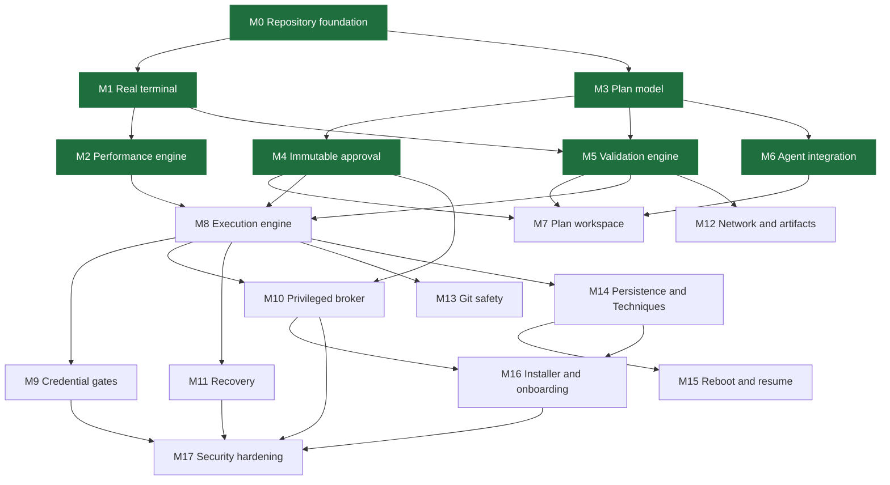

# Implementation dependency graph

Which milestone needs which, and so what order they can be built in. The
milestones are the specification's (§60). An arrow means "needs": the later
milestone uses something the earlier one delivers, not merely that it comes
later in the list.

## Reading it

- **M0 → M1 → M2 are done**, and they were built first on purpose: they are
  the vertical slice that proves the terminal illusion works on real shells
  before any AI orchestration exists to feed it. See
  [milestones-0-2.md](milestones-0-2.md) for what "done" rests on.
- **M3 (plan model) is done** ([milestone-3.md](milestone-3.md)). It was
  the next unblocker: four milestones need it directly.
- **M4 (approval) is done** ([milestone-4.md](milestone-4.md)).
- **M5 (validation) is done** ([milestone-5.md](milestone-5.md)).
- **M6 (agent integration) is done** ([milestone-6.md](milestone-6.md)).
- **M7 (the plan workspace) is done** ([milestone-7.md](milestone-7.md)),
  after M8, M9 and M11, so its screens could show execution, credentials and
  recovery as they really work.
- **M8 (execution) is done** ([milestone-8.md](milestone-8.md)).
- **M9 (credential gates) is done** ([milestone-9.md](milestone-9.md)).
- **M15 (session boundaries) is done** ([milestone-15.md](milestone-15.md)).
- **M14 (persistence and Techniques) is done** ([milestone-14.md](milestone-14.md)).
- **M12 (network and artifacts) is done** ([milestone-12.md](milestone-12.md)).
- **M13 (Git safety) is done** ([milestone-13.md](milestone-13.md)).
- **M11 (recovery) is done** ([milestone-11.md](milestone-11.md)), ahead of
  M10: the broker needs an elevated process and UAC prompts, which cannot be
  checked without someone at the machine
  ([deviation D22](deviations.md#d22-recovery-before-the-broker)).
- **M8 (execution) came before M7 (the plan workspace).** M8 needs only M2,
  M4 and M5, and could be proven headless against real shells; M7 is desktop
  UI that could not be checked on screen while it was being built.
- **M5 and M6 can run in parallel** once M3 lands. Validation needs the plan
  model and the terminal (to run native dry-runs through a real shell); agent
  integration needs only the plan model.
- **M8 is where the performance engine meets approved plans.** Until then the
  engine performs the built-in demo or commands the operator types themselves,
  which carry no approval and are labelled as such
  ([deviation D2](deviations.md#d2-operator-authored-staged-commands)).
- **M10 needs M4**, not just M8: the broker only accepts operations bound to an
  approved plan's step hashes, and those hashes are M4's.
- **M17 is last because it tests everything else.** The threat model is kept
  current at every milestone; M17 is the adversarial pass over the whole.

## Crate order

The same graph, for crates. A crate appears in the first milestone listed:

| Crate | Milestone | First consumer |
| --- | --- | --- |
| `keyjutsu-terminal` | M1 | `keyjutsu-core` sessions |
| `keyjutsu-execution` | M2 | `keyjutsu-core` sessions |
| `keyjutsu-core` | M0 | desktop app and CLI |
| `keyjutsu-plan` | M3 | validation, agents, approval |
| `keyjutsu-validation` | M5 | plan workspace, arming |
| `keyjutsu-agent` | M6 | plan workspace |
| `keyjutsu-security` | M9 | credential steps, logging |
| `keyjutsu-broker` | M10 | elevated steps |
| `keyjutsu-storage` | M14 | session history, Techniques |
