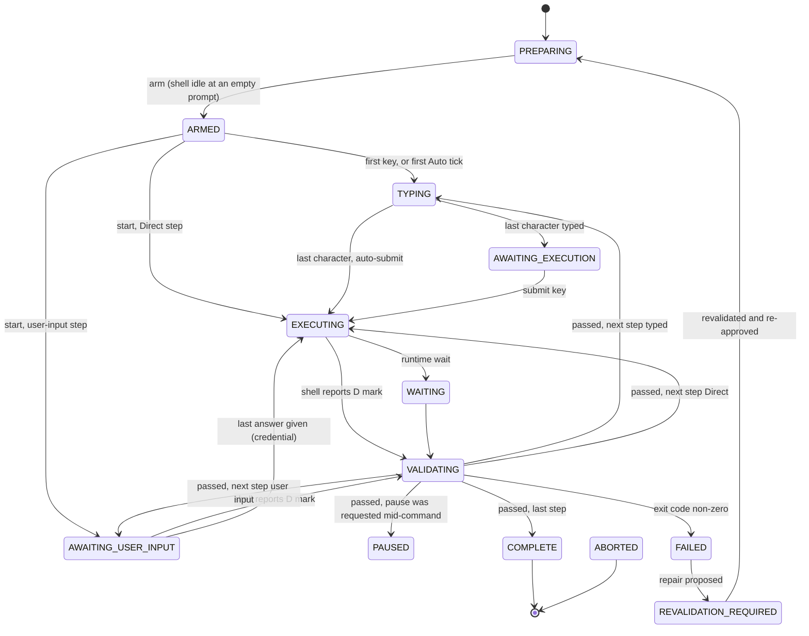

# The execution state machine

Every performance is driven by one state machine, defined in
`crates/keyjutsu-execution/src/state.rs` and enforced by the engine in
`engine.rs`. This page and that table are the same thing written twice; if they
ever disagree, the code is right and this page needs correcting.

The rule the whole design hangs on: **a state changes because something real
happened**. A key was pressed, the shell drew a prompt mark, the shell process
exited, the operator pressed a button. Nothing moves on because a timer ran
out. Timers exist in exactly one place, Auto Performance, and there they only
decide how quickly characters *appear* — never when a command has finished or
when the next step may start.

## States

| State | Meaning | Who owns the keyboard |
| --- | --- | --- |
| `PREPARING` | Staged input exists; nothing is armed yet. | The operator |
| `ARMED` | Armed and waiting for the performance to begin. | KeyJutsu |
| `TYPING` | Staged characters are going onto the shell's input line. | KeyJutsu |
| `AWAITING_EXECUTION` | The whole command is on the line; waiting for the submit key. | KeyJutsu |
| `EXECUTING` | Submitted; waiting for the shell to say the command finished. | KeyJutsu (keys swallowed, Ctrl+C and Esc passed on) |
| `WAITING` | Waiting on an outside condition after a command. Defined, not entered yet: checks are waited for after the performance completes. | KeyJutsu |
| `VALIDATING` | Checking the finished command against its contract. | KeyJutsu |
| `AWAITING_USER_INPUT` | A user-input step: keys go to the shell for real. For a credential, KeyJutsu's command asks and the operator answers; after the last answer the step moves to `EXECUTING`. | The operator, through KeyJutsu |
| `PAUSED` | Nothing advances until Resume. | KeyJutsu |
| `FAILED` | Reality differed from the plan. | The operator |
| `REVALIDATION_REQUIRED` | Something the approval relied on changed. | The operator |
| `COMPLETE` | Every step passed. | KeyJutsu until disarmed (see below) |
| `ABORTED` | Disarmed or abandoned. | The operator |

## Transitions

Not drawn, to keep the diagram readable:

- every non-terminal state can go to `ABORTED` (the hard-disarm chord);
- every state before `EXECUTING`, and `PAUSED`, can go to `REVALIDATION_REQUIRED`;
- every non-terminal state except `FAILED` and `REVALIDATION_REQUIRED` can go
  to `FAILED`, because the shell can exit at any moment;
- `PAUSED` returns to the state it was paused from, or starts the next step
  when the pause was taken between steps.

The full successor lists are `ExecutionState::successors()`. The engine
asserts every change it makes against that table, and the test suite checks
every recorded transition is legal, that every state is reachable from
`PREPARING`, and that `COMPLETE` and `ABORTED` have no way out.

## Decisions worth knowing

**A running command cannot be paused.** The process keeps running whatever
KeyJutsu shows, so a `PAUSED` state during `EXECUTING` would misreport the
machine. A pause asked for mid-command takes effect after validation, before
the next step starts (`VALIDATING → PAUSED`).

**Failure never resumes directly.** `FAILED` leads only to
`REVALIDATION_REQUIRED` or `ABORTED`. A repair is new execution, and new
execution is validated and approved like anything else. That rule is
expressed as missing edges rather than as a rule someone has to remember.

**Ctrl+C is always real.** During `EXECUTING` it reaches the running process
and the shell then reports the failure. During `TYPING` it also reaches the
shell, which abandons the half-typed line, so the engine pauses and retypes
the step from its first character on resume. Swallowing it instead would have
been simpler and wrong: Ctrl+C has to be a genuine interrupt.

**Esc is never a disarm.** While a command runs, Esc goes to it. While
KeyJutsu owns the input line, Esc is swallowed, because PSReadLine and cmd
both clear the line on Esc and the staged text would silently vanish from the
shell while the engine still thought it was there. And ESC followed quickly
by CR reaches PSReadLine as Alt+Enter, which adds a continuation line instead
of submitting.

**Disarming erases what was typed.** A disarm while a staged command is part
way onto the line (in `TYPING`, `AWAITING_EXECUTION`, or paused from either)
sends one DEL per character typed. Without it the fragment stays on the
prompt and runs if the operator presses Enter. Disarming from the operator
controls, which pause first, is the case that shows it; the test is
`disarming_while_paused_mid_command_erases_the_partial_input`.

**`COMPLETE` holds the keyboard.** After the last step KeyJutsu keeps
swallowing keys until the disarm chord, so mashing on past the end does not
spill junk into the shell. Direct mode turns this off, because Direct is for
operations work, not performance.

**A shell without exit codes is not a pass.** cmd.exe cannot report an exit
code in its prompt, so its steps finish as `Unverified`, recorded as such and
never counted as success.

## Where completion comes from

The shell's prompt wrapper emits OSC 133 marks stamped with a per-session
nonce (see [ADR 0003](adr/0003-completion-from-prompt-marks.md)). `D` means the
previous command finished, with its exit code; `B` means the prompt is drawn
and the line is empty. The engine only acts on `D` while it is `EXECUTING`,
`WAITING` or `AWAITING_USER_INPUT`, so a prompt redrawn for any other reason
cannot advance a performance.
