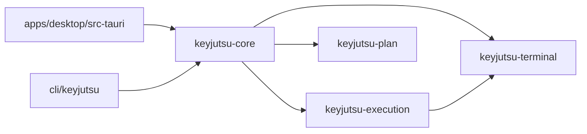

# Architecture overview

KeyJutsu is one Rust core with two front ends. The desktop app (Tauri, React,
xterm.js) and the `keyjutsu` CLI both drive the same `keyjutsu-core`, so there
is exactly one implementation of the rules about what may reach a shell. If a
rule lived in a front end, the other front end would sooner or later disagree
with it.

## The rule that shapes everything

> Agent investigates → agent proposes → KeyJutsu validates → operator reviews
> → operator approves → KeyJutsu executes → KeyJutsu verifies.

The consequence for the code is that authority flows one way. React asks;
Rust decides. An agent proposes; KeyJutsu validates. Nothing in a front end,
and nothing an agent returns, can make KeyJutsu type or run anything that
KeyJutsu's own checks have not allowed.

## Repository layout

What exists now is marked ✓. The rest is the layout the specification's later
milestones fill in; each crate appears in the milestone that gives it its
first real consumer (see [ADR 0005](adr/0005-crates-arrive-with-consumers.md)),
not before.

```text
keyjutsu/
├── apps/desktop/                 ✓ Tauri app: React + xterm.js front end
│   └── src-tauri/                ✓ thin command layer over keyjutsu-core
├── cli/keyjutsu/                 ✓ the `keyjutsu` binary
├── crates/
│   ├── keyjutsu-terminal/        ✓ ConPTY sessions, shell launch, prompt marks,
│   │                               key encoding, terminal profile detection
│   ├── keyjutsu-execution/       ✓ state machine, Performance Mode engine
│   ├── keyjutsu-core/            ✓ sessions, readiness scan, safe demo, IPC types
│   ├── keyjutsu-plan/            ✓ plan model, graph, conditions, walk, diff
│   │                               (hashing and approval arrive with M4)
│   ├── keyjutsu-validation/        M5: layered validation, proof levels
│   ├── keyjutsu-agent/             M6: Codex, Claude Code, Gemini, Copilot, Cursor
│   ├── keyjutsu-security/          M9: credential gates, classified logging
│   ├── keyjutsu-broker/            M10: elevated broker binary and protocol
│   └── keyjutsu-storage/           M14: DPAPI-protected SQLite store
├── packages/types/               ✓ TypeScript generated from the Rust IPC types
├── schemas/plan/v1/              ✓ plan and proposal JSON Schemas, fixtures
├── tests/fixtures/               ✓ shared fixtures (Windows Terminal settings)
├── docs/                         ✓ architecture, ADRs, schema guide
├── installer/                      M16
└── .github/workflows/            ✓ CI
```

`packages/ui` from the specification's suggested layout is not created: its
only consumer would be the desktop app, which is where those components live
until a second consumer exists. Recorded as
[deviation D4](deviations.md#d4-no-packagesui-yet).

## Crate boundaries



Dependencies point one way, towards the platform:

- **`keyjutsu-terminal`** knows about pseudo-consoles, shells, prompt marks and
  key encoding. It never decides what to type. All the Windows-specific code
  lives here, behind types (`PtySession`, `ShellLaunch`) that a later Linux or
  macOS implementation can satisfy; `portable-pty` already has those backends,
  which is part of why it was chosen ([ADR 0002](adr/0002-conpty-through-portable-pty.md)).
- **`keyjutsu-execution`** decides what to type and when. It is a pure state
  machine with no I/O ([ADR 0004](adr/0004-pure-performance-engine.md)); it
  borrows vocabulary types (`KeyChord`, `ShellMark`) from the terminal crate
  and nothing else.
- **`keyjutsu-plan`** knows what a plan is: its shape, its graph, how its
  conditions evaluate and which step comes next. It depends on nothing else in
  the workspace and has no I/O; facts reach it through a trait.
- **`keyjutsu-core`** joins the terminal and the engine: it runs a real session, feeds its marks
  and the operator's keys into the engine, and carries out the engine's
  actions against the pseudo-console. It is the only public surface the front
  ends use.
- **Front ends** translate their own events into core calls and render what
  comes back. The desktop's Rust layer (`src-tauri/src/main.rs`) is about 200
  lines of command wrappers; the CLI's is argument parsing and a console loop.

Core domain logic depends on neither Tauri nor React; `cargo test` builds and
runs everything except the desktop crate without a frontend in sight.

## How a keypress becomes a character on screen

In the desktop app, while armed:

1. xterm.js sees a keydown. `attachCustomKeyEventHandler` stops xterm and the
   browser producing any input from it.
2. `keys.ts` describes the physical key as a `KeyChord` and sends it with
   `terminal_key`. It does not decide what the key means.
3. `keyjutsu-core` classifies it (`classify` in the execution crate). The
   hard-disarm chord is recognised first, before ownership is even checked.
4. The engine returns actions: here, write the next staged character.
5. Core writes that byte to ConPTY while holding the session lock, so bytes
   reach the shell in exactly the order the engine chose.
6. The shell echoes the character. ConPTY sends the echo back; core strips
   its own prompt marks, decodes UTF-8 across read boundaries and streams the
   text to xterm.js over a Tauri channel.

What the user sees in step 6 is the shell's own echo, not a drawing of what
KeyJutsu intended to type. If the shell mangled the input — an auto-pairing
key handler, say — the screen would show that, which is why the readiness
probe types a command and checks what the shell actually ran.

The CLI follows the same path with crossterm in place of xterm.js, and answers
ConPTY's cursor-position queries itself because there is no renderer to do it.

## Where each specification invariant is enforced today

See [THREAT_MODEL.md](../../THREAT_MODEL.md#invariants), which lists every
invariant with its current status, where it is enforced and which test proves
it. Most invariants belong to milestones that are not built yet, and the table
says so rather than implying otherwise.
